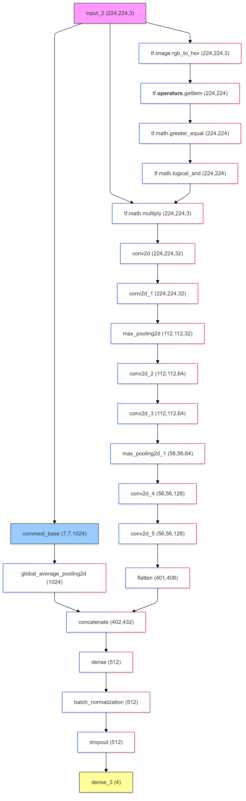

# Leukemia Subtype Classification Using Multi-Cell Images

## Abstract

Blood cancer remains one of the most pressing concerns globally, and its means of diagnosis is still a challenge to this day. Current image-based research on blood cancer cells primarily focuses on single- cell images often neglecting the spatial features between multiple cells. Our aim is to train models for multi-classification task to classify leukemia subtypes using the Acute Lymphoblastic Leukemia (ALL) dataset, which comprises a diverse collection of 3,256 multi-cell blood smear images classed according to their maturity subtypes. In this project, we also proposed a new Convolutional Neural Network (CNN) architecture evaluated multiple machine learning models, including SVM, XGBoost, VGG16, DenseNet- 201, and ConvNeXt. We focused on optimizing accuracy while considering the misclassification costs associated with different leukemia stages, and found that ConvNeXt and DenseNet-201 pretrained model combined with our proposed architecture performs the best, with DenseNet-201 topping in performance across accuracy and having minimal misclassification costs.

##  Dataset

The models in this study will be using the archived dataset of Acute Lymphoblastic Leukemia (ALL) blood cancer, which provides a large collection of 3,242 peripheral blood smear (PBS) images, organized into two subfolders where one contains the original images captured, and the other one pre-segmented. Within each of these two subfolders contains folders which hold images based on developmental subtypes: Benign, Early Pre-B, Pre-B, and Pro-B ALL. The dataset was prepared in the bone marrow laboratory of Taleqani Hospital in Tehran, Iran.

---

## Features

- Multi-cell spatial feature analysis
- CNN-based custom architecture
- Transfer learning with pretrained models (VGG16, DenseNet-201, ConvNeXt)
- Evaluation using classification accuracy and misclassification cost metrics

---

## Proposed CNN Model Architecture



This model architecture integrates a pretrained base model with a U-Net-inspired segmentation block to perform segmentation and classification tasks. The pretrained model, initialized with ImageNet weights and excluding the top classification layers (include_top= FALSE), acts as a feature extractor, capturing high-level image features.
The architecture starts with a functional layer that processes an input image to segment purple regions corresponding to lymphoblasts, using a color threshold in the HSV (Hue, Saturation, Value) color space with specified lower and upper bounds for the hue, saturation, and value channels. The input image is then converted from RGB to HSV format using TensorFlow's rgb_to_hsv function. A binary mask is created by checking if each pixel in the image falls within the defined purple color range for each of the HSV channels.

This mask is then cast to a float32 type and expanded to match the original image's dimensions. The mask is finally applied to the original image by multiplying the RGB values by the mask, segregating the purple regions from the rest of the image, producing a segmented image where only the purple areas (lymphoblasts) are retained.
The segmentation block is based on the U-Net architecture, widely used in image segmentation. The en- coder (contracting path) progressively extracts abstract features through convolutional layers followed by max-pooling. The encoder blocks have 32, 64, and 128 filters in conv1, conv2, and conv3, respectively, with max-pooling reducing spatial resolution. At the bottleneck, two convolutional layers with 256 filters learn abstract features before the decoder begins. The decoder (expansive path) upsamples features using trans- posed convolutional layers and incorporates skip connections from corresponding encoder layers to retain spatial information. Filters in the decoder decrease from 128 to 64 and 32, refining features at each step and reconstructing the spatial resolution for pixel-wise segmentation.

The pretrained base model also extracts features passed through a global average pooling layer, reducing spatial dimensions to a single feature vector. This vector is flattened and concatenated with the segmentation block's output, combining segmentation and pretrained features. The combined features are processed by the classification block, which consists of fully connected layers with 512, 256, and 128 units, each followed by batch normalization, dropout (0.7), and L2 regularization. The final fully connected layer is a softmax layer with four units (Benign, Early, Pre, Pro), producing class probabilities.

---

## Results

| Model         | Accuracy | Misclassification Cost | Notes                            |
|---------------|----------|-------------------------|----------------------------------|
| SVM           | ~        | ~                       | Baseline traditional model       |
| XGBoost       | ~        | ~                       | Tree-based ensemble              |
| VGG16         | ~        | ~                       | Pretrained CNN                   |
| DenseNet-201  | ✅ Best  | ✅ Lowest                | Top performer                    |
| ConvNeXt      | ✅ High  | ✅ Low                   | Strong contender                 |

---

## Usage

1. Clone the repository:
    ```bash
    git clone https://github.com/kelvinweijun/Leukemia-Image-Classifier.git
    cd Leukemia-Image-Classifier
    ```

2. Install dependencies:
    ```bash
    pip install -r requirements.txt
    ```

3. Train the model:
    To train the model, open any of the IPYNB notebooks and run them with a suitable software. Preferably Kaggle, Colab or Jupyter notebook.

4. Evaluate performance:
    To evaluate performance, access this link: 

---

## Acknowledgements

This work was made possible by the ALL image dataset and the support of deep learning libraries such as Keras and Computer Vision models.

---

## License

This project is licensed under the MIT License. See the [LICENSE](LICENSE) file for details.
