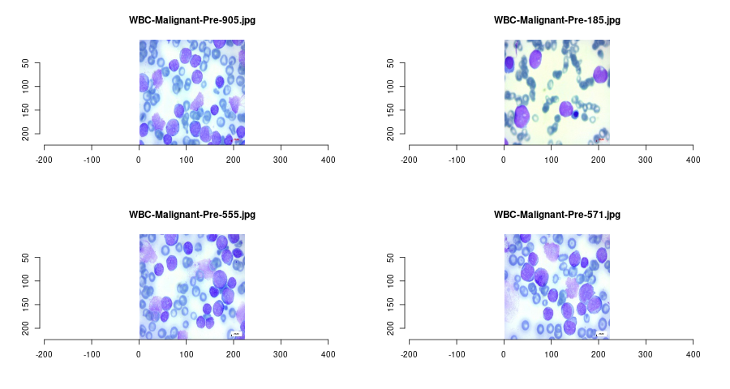
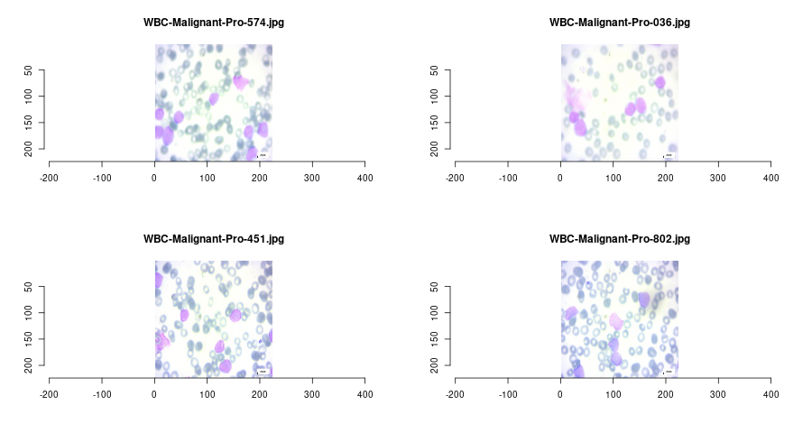

# Leukemia Subtype Classification Using Multi-Cell Images

## Abstract

Blood cancer remains one of the most pressing concerns globally, and its means of diagnosis is still a challenge to this day. Current image-based research on blood cancer cells primarily focuses on single- cell images often neglecting the spatial features between multiple cells. Our aim is to train models for multi-classification task to classify leukemia subtypes using the Acute Lymphoblastic Leukemia (ALL) dataset, which comprises a diverse collection of 3,256 multi-cell blood smear images classed according to their maturity subtypes. In this project, we also proposed a new Convolutional Neural Network (CNN) architecture evaluated multiple machine learning models, including SVM, XGBoost, VGG16, DenseNet- 201, and ConvNeXt. We focused on optimizing accuracy while considering the misclassification costs associated with different leukemia stages, and found that ConvNeXt and DenseNet-201 pretrained model combined with our proposed architecture performs the best, with DenseNet-201 topping in performance across accuracy and having minimal misclassification costs.

##  Dataset

The models in this study will be using the archived dataset of Acute Lymphoblastic Leukemia (ALL) blood cancer, which provides a large collection of 3,242 peripheral blood smear (PBS) images, organized into two subfolders where one contains the original images captured, and the other one pre-segmented. Within each of these two subfolders contains folders which hold images based on developmental subtypes: Benign, Early Pre-B, Pre-B, and Pro-B ALL. The dataset was prepared in the bone marrow laboratory of Taleqani Hospital in Tehran, Iran.




The images displayed clear differentiation between classes especially between Early and Pre, as well as Pro which shows a sudden lightness in colour tone of the cells, reflecting variations in cellular morphology that could be critical for accurate classification. This visual assessment is crucial for confirming the relevance of the dataset to the research objectives and the potential for successful application in automated diagnostic systems. From the exploratory data analysis of the image data and resolution, the only aspect we need to focus on is rebalancing the datas scarcity and unequal sizes in each class via augmentation techniques.

---

## Features

- Multi-cell spatial feature analysis
- CNN-based custom architecture
- Transfer learning with pretrained models (VGG16, DenseNet-201, ConvNeXt)
- Evaluation using classification accuracy and misclassification cost metrics

---

## Proposed CNN Model Architecture


This architecture combines a pretrained CNN backbone with a U-Net-inspired segmentation block for joint segmentation and classification of leukemia cells. The input image is first converted to the HSV color space, and a binary mask isolates purple-stained lymphoblasts based on defined HSV thresholds. This mask is applied to extract segmented regions of interest.

The segmentation block follows the U-Net design, with an encoder-decoder structure using convolutional layers, max pooling, and skip connections. The pretrained model (ImageNet weights, include_top=False) extracts high-level features, which are pooled, flattened, and concatenated with features from the segmentation block.

A classification head processes the combined features through dense layers (512 → 256 → 128) with batch normalization, dropout (0.7), and L2 regularization. The final output is a softmax layer with four units corresponding to leukemia maturity stages: Benign, Early, Pre, and Pro.

---

## Results

| Model       | Train Accuracy | Test Accuracy | Total Misclassification Cost | Average Cost Per Sample | Cost-Sensitive Accuracy | Weighted F1-Score |
|-------------|----------------|---------------|------------------------------|--------------------------|-------------------------|-------------------|
| SVM         | 0.9971         | 0.9517        | 345                          | 0.6660                   | 0.9879                  | 0.9448            |
| XGBoost     | 0.9947         | 0.9479        | 380                          | 0.7336                   | 0.9867                  | 0.9419            |
| VGG16       | 0.8637         | 0.9531        | 385                          | 0.7432                   | 0.9865                  | 0.9503            |
| DenseNet-201| 0.9698         | 0.9961        | 20                           | 0.0386                   | 0.9993                  | 0.9958            |
| ConvNeXt    | 0.9927         | 0.9941        | 40                           | 0.0772                   | 0.9986                  | 0.9950            |

---

## Usage

1. Clone the repository:
    ```bash
    git clone https://github.com/kelvinweijun/Leukemia-Image-Classifier.git
    cd Leukemia-Image-Classifier
    ```

2. Install dependencies:
    ```bash
    pip install -r requirements.txt
    ```

3. Train the model:
    To train the model, open any of the IPYNB notebooks and run them with a suitable software. Preferably Kaggle, Colab or Jupyter notebook.

4. Evaluate performance:
    To evaluate performance, access this link: 

---

## Acknowledgements

This work was made possible by the ALL image dataset and the support of deep learning libraries such as Keras, TensorFlow and caret

---

## License

This project is licensed under the MIT License. See the [LICENSE](LICENSE) file for details.
